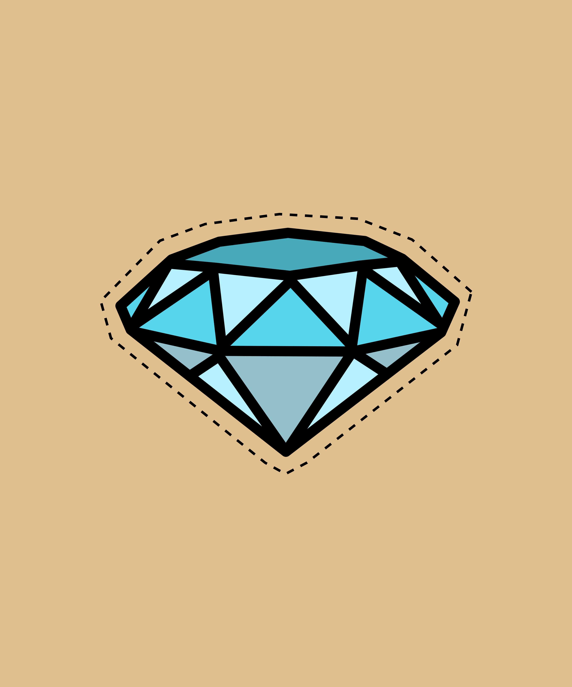

# Code-kombat

<p aling="center">
    
</p>

# Introduction 
 This is an augmented reality project inspired by the mortal kombat game.

 In case you haven't seen the [GT-CODE](https://github.com/PedroPapoti/GT-CODE) project which is based on the detection of images in augmented reality, take a look to understand the structure of the project.

## Face Detection


index.html:
```html
    <!DOCTYPE html>
<html lang="pt-br">
<head>
    <meta charset="UTF-8">
    <meta http-equiv="X-UA-Compatible" content="IE=edge">
    <meta name="viewport" content="width=device-width, initial-scale=1.0">
    <script src="./libs/mindar/mindar-face-three.prod.js"></script>
    <script src="./main.js" type="module"></script>
    <link rel="stylesheet" href="./style.css">
    <title>Code-kombat</title>
</head>
<body>
    <div id="selections">
        
        
        
        
        
      </div>
  
      <button id="capture"></button>
  
      <div id="preview">
        <div id="preview-close">X</div>
        
        <div id="preview-share">Share</div>
      </div>
</body>
</html>
```
style.css:
```css
    html, body {position: relative; margin: 0; width: 100%; height: 100%; overflow: hidden}
      #selections {
	position: fixed;
	left: 50%;
	top: 0;
	z-index: 2;
	width: 100%;
	text-align: center;
	transform: translateX(-50%);
      }
      #selections img {
	border: solid 5px;
	width: 50px;
	height: 50px;
	object-fit: cover;
	cursor: pointer;
	opacity: 0.5;
      }
      #selections img.selected {
	border-color: red;
	opacity: 1;
      }

      #preview {
	position: fixed;
	z-index: 10;
	left: 10%;
	top: 10%;
	width: 80%;
	height: 80%;
	border: solid 10px white;
	visibility: hidden;
      }
      #preview-image {
	width: 100%;
	height: 100%;
      }
      #preview-close {
	position: absolute;
	right: 0;
	top: 0;
	font-size: 20px;
	padding: 5px;
	border: solid 1px;
	cursor: pointer;
	color: white;
	border: solid 5px white;
	right: -5px;
	top: -5px;
      }
      #preview-share {
	border: solid 1px;
	text-align: center;
	cursor: pointer;
	background: white;

	position: absolute;
	left: 50%;
	transform: translateX(-50%);
	bottom: 10px;
	padding: 10px 30px;
	border-radius: 10px;
	border: none;
      }
      #capture {
	position: fixed;
	bottom: 2vh;
	left: 50%;
	height: 12vw;
	width: 12vw;
	border: solid 2px;
	border-radius: 50%;
	transform: translateX(-50%);
	z-index: 10;
      }
```
main.js:
```javascript
import {loadGLTF} from "./libs/loader.js";
const THREE = window.MINDAR.FACE.THREE;

const capture = (mindarThree) => {
  const {video, renderer, scene, camera} = mindarThree;
  const renderCanvas = renderer.domElement;

  const canvas = document.createElement('canvas');
  const context = canvas.getContext('2d');
  canvas.width = renderCanvas.width;
  canvas.height = renderCanvas.height;

  const sx = (video.clientWidth - renderCanvas.clientWidth) / 2 * video.videoWidth / video.clientWidth;
  const sy = (video.clientHeight - renderCanvas.clientHeight) / 2 * video.videoHeight / video.clientHeight;
  const sw = video.videoWidth - sx * 2; 
  const sh = video.videoHeight - sy * 2; 

  context.drawImage(video, sx, sy, sw, sh, 0, 0, canvas.width, canvas.height);
  
  renderer.preserveDrawingBuffer = true;
  renderer.render(scene, camera); 
  context.drawImage(renderCanvas, 0, 0, canvas.width, canvas.height);
  renderer.preserveDrawingBuffer = false;

  const data = canvas.toDataURL('image/png');
  return data;
}

document.addEventListener('DOMContentLoaded', () => {
  const start = async() => {
    
    const mindarThree = new window.MINDAR.FACE.MindARThree({
      container: document.body,
    });
    const {renderer, scene, camera} = mindarThree;

    const light = new THREE.HemisphereLight(0xffffff, 0xbbbbff, 1);
    const light2 = new THREE.DirectionalLight(0xffffff, 0.6);
    light2.position.set(-0.5, 1, 1);
    scene.add(light);
    scene.add(light2);

    
    const captains = await loadGLTF('./models/captains/scene.gltf');
    captains.scene.position.set(0, 0.2, -0.5);
    captains.scene.scale.set(0.40, 0.40, 0.40);
    captains.scene.renderOrder = 1;
    const captainsAnchor = mindarThree.addAnchor(10);
    captainsAnchor.group.add(captains.scene);
    

    const american = await loadGLTF('./models/american/scene.gltf');
    american.scene.position.set(0, -0.2, -0.5);
    american.scene.scale.set(0.060, 0.060, 0.060);
    american.scene.renderOrder = 1;
    const americanAnchor = mindarThree.addAnchor(10);
    americanAnchor.group.add(american.scene);

    const skull = await loadGLTF('./models/skull/scene.gltf');
    skull.scene.position.set(0, -0.9, 0);
    skull.scene.scale.set(0.3, 0.3, 0.3);
    skull.scene.renderOrder = 1;
    const skullAnchor = mindarThree.addAnchor(168); 
    skullAnchor.group.add(skull.scene);

    const mask = await loadGLTF('./models/mask/scene.gltf');
    mask.scene.position.set(0, -0.2, 0);
    mask.scene.scale.set(0.6, 0.6, 0.6);
    mask.scene.renderOrder = 1;
    const maskAnchor = mindarThree.addAnchor(168); 
    maskAnchor.group.add(mask.scene);

    const earringLeft = await loadGLTF('./models/diamond/scene.gltf');
    earringLeft.scene.position.set(0, -0.2, -0.2);
    earringLeft.scene.scale.set(0.8, 0.8, 0.8);
    earringLeft.scene.renderOrder = 1;
    const earringLeftAnchor = mindarThree.addAnchor(127);
    earringLeftAnchor.group.add(earringLeft.scene);

    const earringRight = await loadGLTF('./models/diamond/scene.gltf');
    earringRight.scene.position.set(0.02, -0.2, -0.1);
    earringRight.scene.scale.set(0.8, 0.8, 0.8);
    earringRight.scene.renderOrder = 1;
    const earringRightAnchor = mindarThree.addAnchor(356);
    earringRightAnchor.group.add(earringRight.scene);

    const buttons = ["#captains", "#american", "#skull", "#mask", "#earring"];
    const models = [[captains.scene], [american.scene], [skull.scene], [mask.scene], [earringLeft.scene, earringRight.scene]];
    const visibles = [true, false, false, false, true];

    const setVisible = (button, models, visible) => {
      if (visible) {
	button.classList.add("selected");
      } else {
	button.classList.remove("selected");
      }
      models.forEach((model) => {
	model.visible = visible;
      });
    }
    buttons.forEach((buttonId, index) => {
      const button = document.querySelector(buttonId);
      setVisible(button, models[index], visibles[index]);
      button.addEventListener('click', () => {
	visibles[index] = !visibles[index];
	setVisible(button, models[index], visibles[index]);
      });
    });

    const previewImage = document.querySelector("#preview-image");
    const previewClose = document.querySelector("#preview-close");
    const preview = document.querySelector("#preview");
    const previewShare = document.querySelector("#preview-share");

    document.querySelector("#capture").addEventListener("click", () => {
      const data = capture(mindarThree);
      preview.style.visibility = "visible";
      previewImage.src = data;
    });

    previewClose.addEventListener("click", () => {
      preview.style.visibility = "hidden";
    });

    previewShare.addEventListener("click", () => {
      const canvas = document.createElement('canvas');
      canvas.width = previewImage.width;
      canvas.height = previewImage.height;
      const context = canvas.getContext('2d');
      context.drawImage(previewImage, 0, 0, canvas.width, canvas.height);

      canvas.toBlob((blob) => {
	const file = new File([blob], "photo.png", {type: "image/png"});
	const files = [file];
	if (navigator.canShare && navigator.canShare({files})) {
	  navigator.share({
	    files: files,
	    title: 'AR Photo',
	  })
	} else {
	  const link = document.createElement('a');
	  link.download = 'photo.png';
	  link.href = previewImage.src;
	  link.click();
	}
      });
    });

    await mindarThree.start();
    renderer.setAnimationLoop(() => {
      renderer.render(scene, camera);
    });
  }
  start();
});

```
If you have any questions, please contact me by email pedropapoti@gmail.com.
